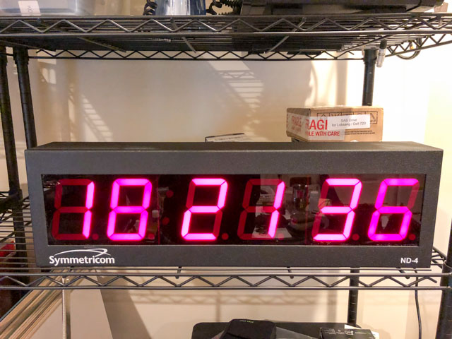
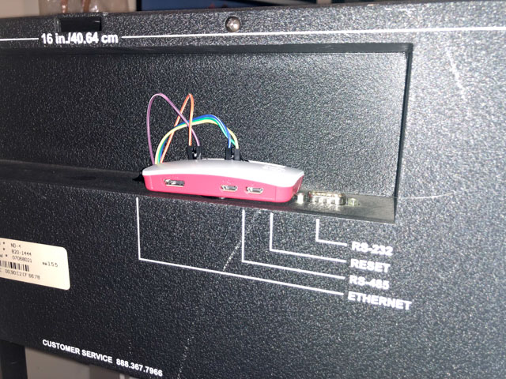

This small Python program uses a Raspberry Pi Zero W to drive the display portion
of a Symmetricom ND-4 display ([manual](http://www1.symmetricom.com/media/files/support/ttm/product-manual/ND_um.pdf))

I originally did this because the processor board on my ND-4 died (the Realtek POE Ethernet chip would get really hot), 
but it also converts the ND-4 into a Wi-Fi display. Obviously, you should run NTP on the Pi.

It replaces the processor board of the ND-4, and uses SPI to drive the LEDs though the 
(onboard) [MAX7219](https://datasheets.maximintegrated.com/en/ds/MAX7219-MAX7221.pdf)

This replaces the processor board of the ND-4, and powers the Pi from the
internal ND-4 power supply. The original processor board is simply removed, and the
Raspberry Pi W is connected as below. The Pi's SPI interface drives the
MAX7219 (which is conveniently on the power-supply board).

The wiring is as follows:

|ND-4 | MAX7219 | Function     |  Pi Pin |
|-----|---------|--------------|---------|
|VCC  |         |  VCC         |  2  |
|GND  |         |  GND         |  6  |
|PA0  |CLK      |  SPI CLK(11) |  23 |
|PA1  |LOAD/CS  |  SPI CE0(8)  |  24 |
|PA2  |DIN      |  MOSI(10)    |  19 |

All the hard work is done by Richard Hull's [luma.led_matrix](https://github.com/rm-hull/luma.led_matrix) library. 
